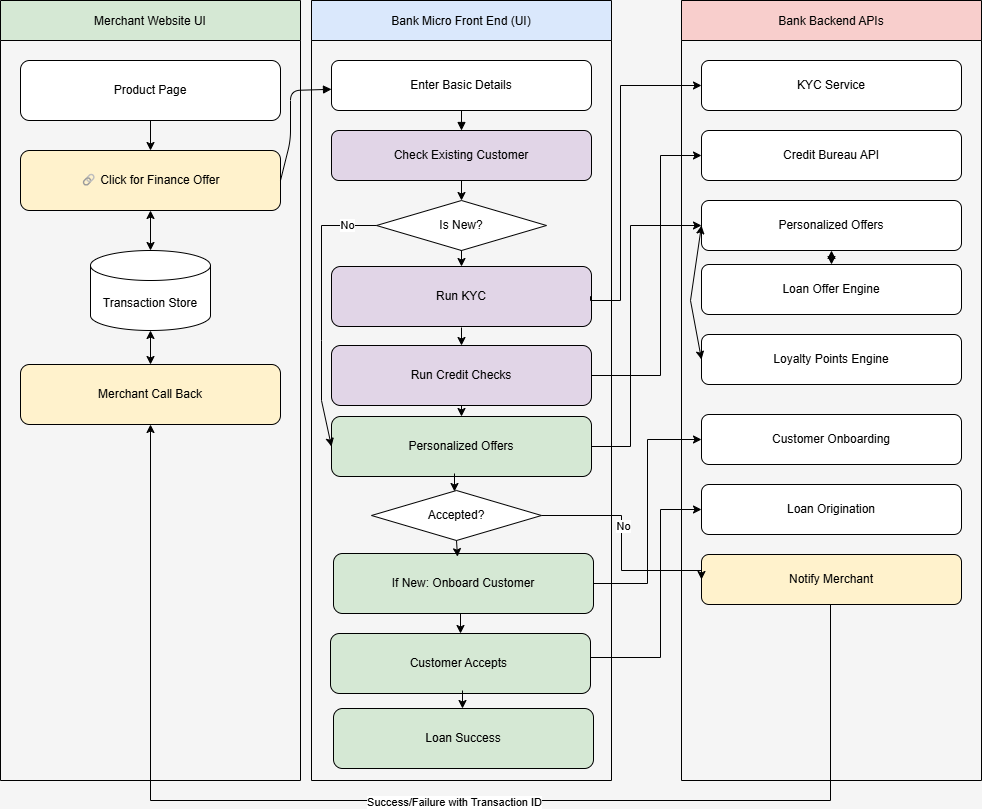

# EF
# Composable Embedded Finance Demo

## Overview
This project demonstrates a Composable Embedded Finance architecture involving both a **Merchant** and a **Bank** system. The goal is to showcase how financial products (like Buy Now Pay Later or instant EMI offers) can be dynamically embedded into the merchant checkout journey via micro frontends and secure APIs.

## Why Composable Architecture for Embedded Finance?

### Merchant Side
- **Flexibility**: Merchants can plug and play financial products from different providers without tight integration.
- **Personalization**: Offers are tailored to the user context in real time.
- **Seamless UX**: The user stays within the checkout journey with no redirects.

### Bank Side
- **Reusability**: Bank services like KYC, credit scoring, and loan origination are modular and can be reused across partners.
- **Security**: Interactions are JWT-authenticated, and callbacks are secure.
- **Event-driven**: Merchants are notified asynchronously, enabling decoupled workflows.

---

## Architecture Overview



---

## Project Structure
```
├── merchant_backend.py     # Merchant APIs
├── merchant_frontend.py    # Merchant Checkout UI
├── bank_backend.py         # Bank API services (KYC, credit bureau, etc.)
├── bank_mfe.py             # Bank Micro Frontend (UI for offer capture)
├── templates/              # HTML templates
├── static/                 # CSS and static files
├── requirements.txt
└── README.md
```

---

## Running the Modules

### Prerequisites
- Python 3.9+
- Install dependencies:
  ```bash
  pip install -r requirements.txt
  ```

### Start Merchant Backend
```bash
uvicorn merchant_backend:app --reload --port 8002
```

### Start Merchant Frontend
```bash
uvicorn merchant_frontend:app --reload --port 8000
```

### Start Bank Backend
```bash
uvicorn bank_backend:app --reload --port 8003
```

### Start Bank Micro Frontend
```bash
uvicorn bank_mfe:app --reload --port 8001
```

---

## Simulated Flow
1. User checks out on merchant site.
2. Clicks "Check EMI Offers" to invoke Bank Micro Frontend.
3. Existing customers see offers instantly.
4. New customers complete KYC and credit scoring.
5. Bank originates loan and notifies the merchant.
6. Merchant updates checkout flow upon receiving callback.

---

## Authors & License
MIT License. Created for demo purposes to explore composable architectures in FinTech.

---


